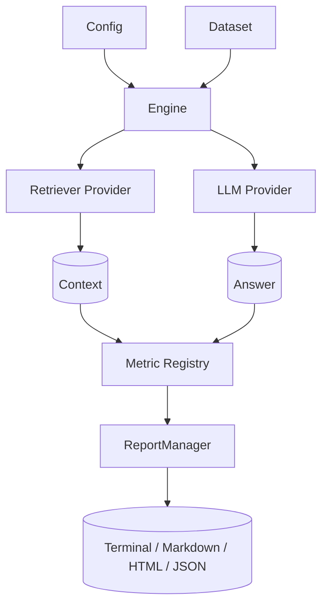

# Architecture

OpenAgent Eval is organized as a modular, provider-agnostic pipeline built on a hexagonal (ports &
adapters) design. This page describes the high-level design and the responsibility of each component.

## Design principles

- **Local-first** — everything runs on your machine; no telemetry or required network calls.
- **Configuration-driven** — a single `Config` model describes datasets, providers, and metrics.
- **Pluggable** — retrievers, LLMs, embedders, metrics, and report formats are interfaces you implement.
- **Async by default** — the engine and providers use `async`/`await` for efficient concurrency.
- **Failure-aware** — reports explain *why* an evaluation failed, not just *that* it failed.

## Pipeline overview

## Components

### Configuration (`openagent_eval.config`)

Pydantic models (`Config`, `LLMConfig`, `RetrieverConfig`, `EmbedderConfig`, `MetricsConfig`,
`DatasetConfig`, `ReportConfig`) validate and load `config.yaml`. `load_config()` also normalizes
legacy config shapes for backward compatibility.

### Core orchestration (`openagent_eval.core`)

| Module | Responsibility |
| --- | --- |
| `engine.py` | `Engine` — top-level orchestrator; builds providers/metrics and runs the pipeline |
| `pipeline.py` | `Pipeline` — runs retrieve → generate → score per item; returns `PipelineResult` |
| `executor.py` | `Executor` — runs items concurrently with a worker pool and timeout |
| `registry.py` | `Registry` — resolves metric/provider/retriever/dataset/report classes by name |

### Datasets (`openagent_eval.datasets`)

Loaders normalize multiple formats into validated `DatasetItemModel` objects:

- `json_loader` — JSON arrays of question/reference/context
- `jsonl_loader` — newline-delimited JSON
- `csv_loader` — tabular datasets
- `pdf_loader` — extract items from PDF documents

Format is auto-detected from the file extension, or set explicitly via `dataset.format`.

### Providers (`openagent_eval.providers`)

Adapters behind stable base classes (`LLMProvider`, `Retriever`, `Embedder`), constructed by a factory:

- **LLM** — OpenAI, Google Gemini, Anthropic, Groq, OpenRouter, Ollama, Mock
- **Retrievers** — Chroma, Memory, BM25, FAISS, Qdrant, Pinecone, Weaviate, Elasticsearch, PGVector, HTTP, Mock
- **Embedders** — Sentence-Transformers, Mock

### Metrics (`openagent_eval.metrics`)

Metrics implement `BaseMetric.evaluate(**kwargs) -> MetricResult` and are registered in
`METRIC_REGISTRY`:

- `retrieval` — `context_precision`, `context_recall`, `recall_at_k`, `precision_at_k`, `hit_rate`, `mrr`, `ndcg`
- `generation` — `faithfulness`, `answer_relevancy`, `hallucination`, `semantic_similarity`, `exact_match`, `f1_score`, `bleu`, `rouge`, `bertscore`
- `performance` — `latency`
- `cost` — `token_count`

### Reports (`openagent_eval.reports`)

`ReportManager` persists reports as JSON (`{report_id}.json`) and supports `save_report`, `load_report`,
`list_reports`, `get_latest_report`, and `reconstruct`. Format-specific generators render terminal,
markdown, HTML, JSON, and comparison output.

### Plugins (`openagent_eval.plugins`)

A discovery + loader + manager system (`PluginManager`, `PluginLoader`) loads custom metrics, providers,
and report generators — typically via entry points — and registers them in the central `Registry`.

### CLI (`openagent_eval.cli`)

A [Typer](https://typer.tiangolo.com)-based CLI (`oaeval`) exposes the engine through commands:
`init`, `run`, `report`, `compare`, `list`, and `doctor`.

## Request lifecycle

1. `oaeval run config.yaml` loads and validates the `Config`.
2. The dataset loader produces validated items.
3. For each item, the pipeline retrieves context and generates an answer (concurrently via the `Executor`).
4. Selected metrics score the result into a `MetricResult`.
5. `ReportManager` persists and renders the report.

## Next steps

- See the [CLI Reference](cli.md) for command details.
- Browse the [API Reference](api.md) for the public interfaces.
- Check the [Roadmap](roadmap.md) for upcoming components.
