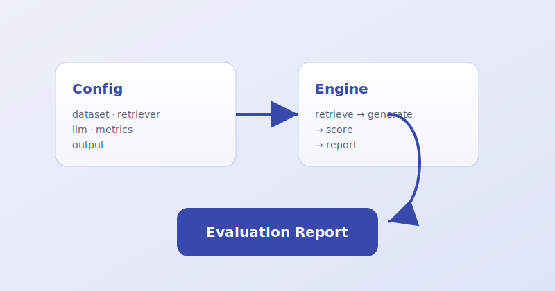
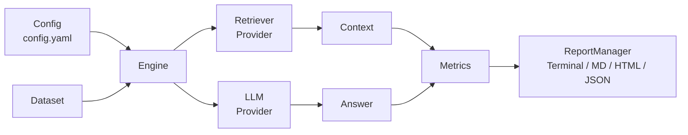

---
hide:
  - navigation
  - toc
---

# OpenAgent Eval

<div class="oae-hero">
  <div class="oae-hero__copy">
    <span class="oae-badge">v0.1.0 · Local-first · Apache 2.0</span>
    <h1>The pytest of AI evaluation</h1>
    <p class="oae-lede">
      Open-source, local-first framework for evaluating RAG systems and AI agents.
      A clean CLI, a typed Python SDK, and a pluggable metric &amp; provider architecture —
      measure quality the way you test code.
    </p>
    <div class="oae-cta">
      <a href="installation.md" class="md-button md-button--primary">Get Started</a>
      <a href="https://github.com/OpenAgentHQ/openagent-eval" class="md-button">GitHub</a>
    </div>
    <div class="oae-install">pip install openagent-eval</div>
  </div>
  <div class="oae-hero__art">
    
  </div>
</div>

---

## Why OpenAgent Eval

<div class="grid cards oae-features" markdown>

- :material-rocket-launch: **Local-First**
  Runs entirely on your machine. No dashboards or accounts required — your data never leaves your laptop.

- :material-console-line: **CLI + SDK**
  Drive evaluations from the command line with `oaeval`, or embed `Engine` directly in your Python test suite.

- :material-puzzle: **Framework Agnostic**
  Works with any RAG implementation — LangChain, LlamaIndex, or fully custom pipelines.

- :material-puzzle-plus: **Pluggable**
  Swap LLMs, retrievers, embedders, and metrics through a clean provider/plugin architecture.

- :material-chart-box: **Comprehensive Metrics**
  Retrieval, generation, performance, and cost metrics in one consistent interface.

- :material-file-document-multiple: **[Beautiful Reports](reports-output-formats.md)**
  Terminal, Markdown, HTML, and JSON reports with built-in failure analysis.

</div>

---

<div class="oae-section">
  <span class="oae-eyebrow">Quick Start</span>
  <h2>From install to insight in minutes</h2>
</div>

```bash
# Install
pip install openagent-eval

# Create a configuration file
oaeval init

# Run your first evaluation
oaeval run config.yaml

# Inspect the report
oaeval report latest
```

See the [Quickstart](quickstart.md) for a full walkthrough, or jump straight to the
[CLI Reference](cli.md).

---

<div class="oae-section">
  <span class="oae-eyebrow">Architecture</span>
  <h2>One pipeline, every stage pluggable</h2>
</div>

A `Config` describes your dataset, retriever, LLM, and the metrics to compute. The `Engine` loads the
dataset, runs retrieval and generation, scores the results, and persists a report.



Every stage is pluggable. Read more on the [Architecture](architecture.md) page.

---

<div class="oae-section">
  <span class="oae-eyebrow">Evaluation Metrics</span>
  <h2>Four categories, one consistent score</h2>
</div>

Metric names map to the built-in registry (`openagent_eval.metrics.METRIC_REGISTRY`):

<div class="grid cards oae-features" markdown>

- :material-magnify: **Retrieval**
  `context_precision`, `context_recall`, `recall_at_k`, `precision_at_k`, `hit_rate`, `mrr`, `ndcg`

- :material-message-text: **Generation**
  `faithfulness`, `answer_relevancy`, `hallucination`, `semantic_similarity`, `exact_match`, `f1_score`, `bleu`, `rouge`, `bertscore`

- :material-timer: **Performance**
  `latency`

- :material-currency-usd: **Cost**
  `token_count`

</div>

---

<div class="oae-section">
  <span class="oae-eyebrow">Supported Providers</span>
  <h2>Bring your own, or use what ships</h2>
</div>

| LLM Providers | Retriever Providers | Embedders |
| --- | --- | --- |
| OpenAI, Google Gemini, Anthropic, Groq, OpenRouter, Ollama, Mock | Chroma, Memory, BM25, FAISS, Qdrant, Pinecone, Weaviate, Elasticsearch, PGVector, HTTP, Mock | Sentence-Transformers, Mock |

Bring your own by implementing the provider base classes — see [API Reference](api.md).

---

<div class="oae-section">
  <span class="oae-eyebrow">Python SDK</span>
  <h2>Embed evaluation in your test suite</h2>
</div>

```python
import asyncio

from openagent_eval.config.models import Config
from openagent_eval.core.engine import Engine

config = Config(
    dataset={"path": "data/questions.json"},
    llm={"provider": "openai", "model": "gpt-4o-mini"},
    retriever={"provider": "chroma", "settings": {"collection_name": "my_collection"}},
)
engine = Engine(config)
report = asyncio.run(engine.run(dataset))
print(report.summary)
```

The SDK is fully documented in the [API Reference](api.md) and demonstrated in
[Examples](examples.md).

---

<div class="oae-section">
  <span class="oae-eyebrow">CLI</span>
  <h2>Six commands cover the whole loop</h2>
</div>

| Command | Description |
| --- | --- |
| `oaeval init` | Create a configuration file |
| `oaeval run <config>` | Run an evaluation pipeline |
| `oaeval report <id>` | View a stored report (`latest` for the most recent) |
| `oaeval compare <a> <b>` | Compare two experiments |
| `oaeval list` | List previous evaluations |
| `oaeval doctor` | Check environment and dependencies |

Full command documentation lives in [CLI Reference](cli.md).

---

<div class="oae-section">
  <span class="oae-eyebrow">Contributing</span>
  <h2>Built in the open, by the community</h2>
</div>

OpenAgent Eval is community-driven. Contributions of every size are welcome — from bug reports to new
metrics and providers.

- Read the [Contributing Guide](contributing.md)
- Track what's next in the [Roadmap](roadmap.md)
- Find answers in the [FAQ](faq.md)

---

<div class="oae-section oae-center">
  <span class="oae-eyebrow">Community</span>
  <h2>Help shape the roadmap</h2>
</div>

Stay connected:

- :fontawesome-brands-github: [GitHub](https://github.com/OpenAgentHQ/openagent-eval)
- :fontawesome-brands-x-twitter: [X / Twitter](https://x.com/openagentdev)
- :fontawesome-brands-linkedin: [LinkedIn](https://www.linkedin.com/company/openagenthq)
- :octicons-issue-opened-16: [Issues](https://github.com/OpenAgentHQ/openagent-eval/issues)
- :octicons-comment-discussion-16: [Discussions](https://github.com/OpenAgentHQ/openagent-eval/discussions)

---

<div class="oae-center" markdown>

**OpenAgent Eval** &mdash; Apache 2.0 License. Built by the OpenAgent Eval Contributors.

</div>
