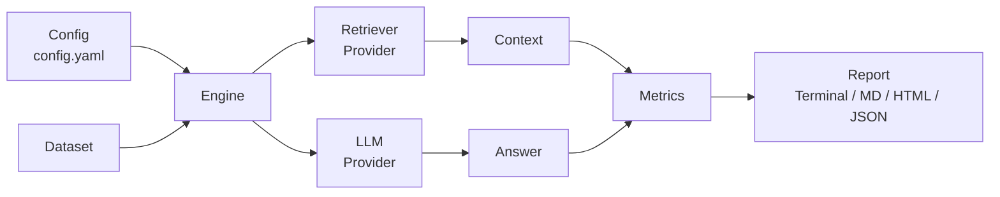

---
hide:
  - navigation
  - toc
---

# OpenAgent Eval

<center>

::: {.center .hero .tx-center}

# OpenAgent Eval
## The `pytest` of AI evaluation

**Open-source CLI framework for evaluating RAG systems and AI Agents — local-first, developer-friendly, and framework agnostic.**

[Getting Started :octicons-arrow-right-24:](installation.md){ .md-button .md-button--primary }
[View on GitHub :octicons-mark-github-16:](https://github.com/OpenAgentHQ/openagent-eval){ .md-button }

```bash
pip install openagent-eval
```

:::

</center>

---

## Why OpenAgent Eval

<div class="grid cards" markdown>

- :material-rocket-launch: **Local-First**
  Runs entirely on your machine. No cloud services, dashboards, or authentication required — your data never leaves your laptop.

- :material-console-line: **CLI + SDK**
  Drive evaluations from the command line with `oaeval`, or import `openagent_eval` directly into your Python test suite.

- :material-puzzle: **Framework Agnostic**
  Works with any RAG implementation — LangChain, LlamaIndex, or fully custom pipelines.

- :material-puzzle-plus: **Plugin-Based**
  Extend the framework with custom metrics, providers, and report generators through a clean plugin API.

- :material-chart-box: **Comprehensive Metrics**
  Retrieval, generation, performance, and cost evaluation in a single, consistent interface.

- :material-file-document-multiple: **Beautiful Reports**
  Terminal, Markdown, HTML, and JSON output formats with built-in failure analysis.

</div>

---

## Quick Start

```bash
# Install
pip install openagent-eval

# Initialize a configuration file
oaeval init

# Run your first evaluation
oaeval run config.yaml

# Inspect the report
oaeval report latest
```

See the [Quickstart](quickstart.md) for a full walkthrough, or jump straight to the
[CLI Reference](cli.md).

---

## Architecture Overview

OpenAgent Eval is built as a modular pipeline. A configuration file describes your dataset, retriever,
LLM, and the metrics you want to compute. The engine loads the dataset, runs retrieval and generation,
then scores the results with the selected metrics and produces a report.



Every stage is pluggable. Read more on the [Architecture](architecture.md) page.

---

## Evaluation Metrics

<div class="grid cards" markdown>

- :material-magnify: **Retrieval**
  Context Precision, Context Recall, Recall@K, Precision@K, Hit Rate, MRR, NDCG.

- :material-message-text: **Generation**
  Faithfulness, Answer Relevancy, Hallucination, Semantic Similarity, Exact Match / F1, BLEU / ROUGE, BERTScore.

- :material-timer: **Performance**
  Embedding, retrieval, and LLM latency plus total end-to-end latency.

- :material-currency-usd: **Cost**
  Token counting (prompt, completion, total) and per-provider cost estimation.

</div>

---

## Supported Providers

| LLM Providers | Retriever Providers |
| --- | --- |
| OpenAI, Google Gemini, Anthropic, Groq, OpenRouter, Ollama (local) | Chroma (more coming soon) |

Bring your own by implementing the provider base classes — see [API Reference](api.md).

---

## Python SDK

```python
from openagent_eval import Evaluator

evaluator = Evaluator(config_path="config.yaml")
result = evaluator.evaluate(dataset)

print(result.summary)
```

The SDK is fully documented in the [API Reference](api.md) and demonstrated in
[Examples](examples.md).

---

## CLI

| Command | Description |
| --- | --- |
| `oaeval init` | Create a configuration file |
| `oaeval run <config>` | Run an evaluation pipeline |
| `oaeval report <id>` | View evaluation reports |
| `oaeval compare <a> <b>` | Compare two experiments |
| `oaeval list` | List previous evaluations |
| `oaeval doctor` | Check environment and dependencies |

Full command documentation lives in [CLI Reference](cli.md).

---

## Contributing

OpenAgent Eval is community-driven. Contributions of every size are welcome — from bug reports to new
metrics and providers.

- Read the [Contributing Guide](contributing.md)
- Track what's next in the [Roadmap](roadmap.md)
- Find answers in the [FAQ](faq.md)

---

## Community

Stay connected and help shape the roadmap:

- :fontawesome-brands-github: [GitHub](https://github.com/OpenAgentHQ/openagent-eval)
- :fontawesome-brands-x-twitter: [X / Twitter](https://x.com/openagentdev)
- :fontawesome-brands-discord: [Discord](https://discord.gg/openagenthq)
- :octicons-issue-opened-16: [Issues](https://github.com/OpenAgentHQ/openagent-eval/issues)
- :octicons-comment-discussion-16: [Discussions](https://github.com/OpenAgentHQ/openagent-eval/discussions)

---

<div class="center" markdown>

**OpenAgent Eval** &mdash; Apache 2.0 License. Built by the OpenAgent Eval Contributors.

</div>
